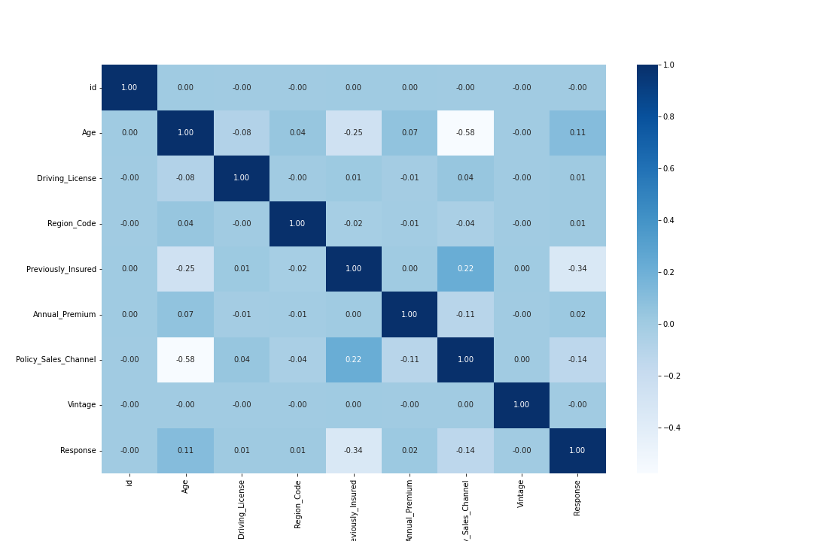

# Health Insurance Cross Sell Predictions: Project Overview 
* Build a model that can help companies predict the interest of their Health Insurance customers in their vehicle insurance product offerings
* This dataset is obtained from Kaggle
* Defining Problem Statement, Goal, Objectives and Business Metrics 
* Engineered features to optimizing the learning process of model 
* Train model with 5 different algorithms
* Draw conclusion from all the modeling processes and the benefits for the company.

## Code and Resources Used 
**Python Version:** 3.7  
**Packages:** pandas, numpy, sklearn, matplotlib, seaborn, xgboost  
**Dataset:** https://www.kaggle.com/datasets/anmolkumar/health-insurance-cross-sell-prediction

## Business Understanding
* ### Problem Statement
The insurance company that has provided Health Insurance to its customers now they need help in building a model to predict whether the customers from the past year will also be interested in Vehicle Insurance provided by the company.
* ### Goal
Companies can plan appropriate and effective communication strategies to reach these customers and optimize their business models and revenues.
* ### Objective
Build a machine learning model that can help companies predict the interest of their Health Insurance customers in their vehicle insurance product offerings
* ### Metrics Evaluation
I use Recall Score and ROC-AUC Score as evaluation metrics for the model in order to reduce the error when predicting customers who are actually "Interested" but are predicted to be "Uninterested" by the machine which will make the company lose potential customers.

## Data Understanding - EDA
### 1. General information about dataset

From the image above, this dataset:
* It consists of 12 columns and 381109 rows
* Has no missing values
* All data types are correct
### 2. Distribution of Target Variable

In the `Response` column or the column that acts as the target column, it contains the numbers 0 and 1. The number 0 indicates that the customer is not interested and the number 1 indicates that the customer is interested in the vehicle insurance offer that the company offers. It can be seen that the comparison is quite lame, more people are not interested. This can also be referred to as the `Imbalance Dataset`. Things like this can affect performance when modeling. If needed, we can do oversampling or under sampling techniques during modeling later in order to get optimal model performance. 
### 3. Box Plot

For the boxplot, the most important thing we should pay attention to is the presence of an outlier.
* Outliers are seen mainly in the `Annual Premium` column
* From the boxplot it also appears which columns whose distribution looks a bit skewed: `Age` and `Policy Sales Channel`
### 4. Correlation Heatmap

From the correlation heatmap above, it can be seen that:

* Our target `Response` column correlates quite strongly with `Previously Insured` but the correlation is negative.
* It has a weak positive correlation with Age and a weak negative correlation with `Policy Sales Channel` (decent potential feature)
* While the `Response` correlation with `Driving License` and `Region Code` is very weak ~0, this indicates they may not be potential features
* The `Age` column has a fairly strong negative correlation with the `Policy Sales Channel`, but this correlation is not strong enough to be said to be redundant.
* `Vintage` columns have no correlation at all with any column, indicating this column is not important and can be discarded.
## Data Processing
* Dividing the dataset into 2 parts, namely `training data` and `test data` so that `data leakage` doesn't occur in the test data.
* Drop the "id" column because it's just an `identity column` per row and will have no effect on the model.
* Drop duplicate data rows just on train data.
* Handling outliers using IQR on "Annual Premium" column just on train data.
* Labeling categorical columns.
* Do Feature selection using `Correlation Heatmap` and `Information Gain`.
* Data `normalization` because some columns have different measurement scales.

## Model Building 

I tried five different models:
*	**Logistic Regression** – Baseline for the classification model
*	**Random Forest** – Good performance on Imbalanced dataset and no problem of overfitting.
*	**Decision Tree** – Easy to explain and easy to visualization. 
*	**Naive Bayes** – It very fast algorithm and have good performance with high dimensional data.
*	**XGBoost** – Good model performance and less prone to overfitting.

## Model performance
The XGBoost model has a slightly better score among the other four models. 

## Conclusion
Here i don't do Hyperparameter tuning because even without that the score is pretty good. After getting model with the best score, namely XGBoost, it's hoped that this model can predict quite precisely which customers are interested and who aren't interested so that it can assist companies to save time and costs in offering to only potentially interested customers.